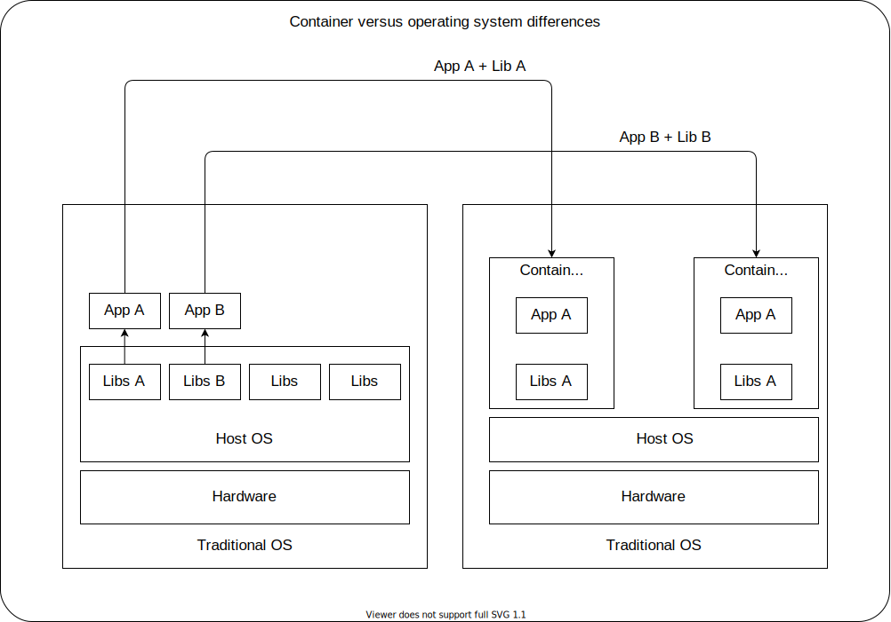
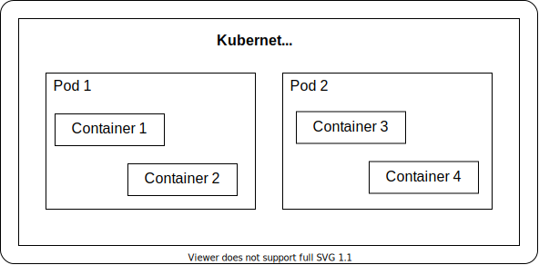

# **Containers**
Is a set of one or more processes that are isolated from the rest of the system.

In traditional software applications, there are usually dependencies on other libraries, configuration files, or services that are provided by the runtime environment, which is a physical host or virtual machine and those dependencies mentioned earlier are installed as part of the host.

The major drawback of those environments is the possibility to break the software application every time there is a need to update the runtime environment.

Furthermore, applications must be stopped before updating the associated dependencies. To minimize downtime, organizations use complex systems to provide high availability. Maintaining multiple applications on a single host becomes cumbersome, since any update, as previously mentioned, has the potential to break one of the applications.

The image below shows the difference between container and operating systems.



Using containers provides many of the benefits as virtual machines, such as security, storage and network isolation, demanding fewer hardware resources. Also, they are quick to start and to terminate and isolate the libraries and the runtime resources, such as CPU and storage, and minimize the impact of OS updates.

Furthermore, beyond improving efficiency, elasticity and reusability of hosted applications, container usage improves application portability. The Open Container Initiative (OCI) provides a set of industry standards that define a container runtime specification and a container image specification. 

The image specification defines the format for the bundle of files and metadata that form a container image. When you build a container image compliant with the OCI standard, you can use any OCI-compliant container engine to execute the contained application. There are many container engines available to manage and execute containers, including Rocket, Drawbridge, LXC, Docker, and Podman.

The following are other major advantages to using containers:

### **Low hardware footprint**
- Containers use OS-internal features to create an isolated environment where resources are
managed using OS facilities such as namespaces and cgroups. This approach minimizes the
amount of CPU and memory overhead compared to a virtual machine hypervisor. Running an
application in a VM isolates the application from the running environment, but it requires a
heavy service layer to achieve the level of isolation provided by containers.

### **Environment isolation**
- Containers work in a closed environment where changes made to the host OS or other
applications do not affect the container. Because the libraries needed by a container are self-
contained, the application can run without disruption. For example, each application can exist
in its own container with its own set of libraries. An update made to one container does not
affect other containers.

### **Quick deployment**
- Containers deploy quickly because there is no need to install the entire underlying operating
system. Normally, to support isolation, a host requires a new OS installation, and any update
might require a full OS restart. A container restart does not require stopping any services on
the host OS.

### **Multiple environment deployment**
- In a traditional deployment scenario using a single host, any environment differences could
break the application. By using containers, all application dependencies and environment
settings are encapsulated in the container image.

### **Reusability**
- The same container can be reused without the need to set up a full OS. For example, the
same database container that provides a production database service can be used by each
developer to create a development database during application development. By using
containers, there is no longer a need to maintain separate production and development
database servers. A single container image is used to create instances of the database
service.

In short, containers are an ideal approach when using microservices for application development, in which each service is encapsulated in a lightweight and reliable container environment that can be deployed to a production or development environment. The collection of containerized services required by an application can be hosted on a single machine, removing the need to manage a machine for each service.

In contrast, many applications are not well suited for a containerized environment. For example, application accessing low level hardware information, such as memory, file systems, and devices may be unreliable due to container limitations.

## **Limitations of containers**
When using containers in a production environment, enterprises often require the following capabilities:

- Easy communication between numerous services;
- Resources limits on applications;
- Ability to respond to application usage spikes by increasing or decreasing replicas;
- Gradual rollout of a new release to different users.

Enterprises often require a container orchestration technology because container runtimes, by themselves, do not adequately address the above requirements.

# **Kubernetes**
Kubernetes is a container orchestration platform that simplifies the deployment, management, and scaling of containerized applications.

A pod is the smallest manageable unit in Kubernetes and consists of, at least, one container that is used by the container orchestration to manage the containers and their resource limits as a single unit.

Kubernetes offers the following features on top of a container engine:

### **Service discovery and load balancing**
- Kubernetes enables inter-service communication by assigning a single DNS entry to each set
of containers. This way, the requesting service only needs to know the target's DNS name,
allowing the cluster to change the container's location and IP address. This permits load-
balancing requests across the pool of container replicas.

### **Horizontal scaling**
- Applications can scale up and down manually or automatically with a configuration set, by
using either the command-line interface or the web UI.

### **Self-healing**
- Kubernetes can use user-defined health checks to monitor containers to restart and
reschedule them in case of failure.

### **Automated rollout**
- Kubernetes can gradually release updates to your application's containers while checking their
status. If something goes wrong during the rollout, Kubernetes can roll back to the previous
version of the application.

### **Secrets and configuration maps**
- You can manage the configuration settings and secrets of your applications without rebuilding
containers. Configuration maps store these settings in a way that decouples them from the
pods and containers using them. Application secrets can include any configuration setting
that must be kept private, such as usernames, passwords, and service endpoints.

### **Operators**
- Operators are packaged Kubernetes applications that bring the knowledge of application
lifecycles into the Kubernetes cluster. Applications packaged as Operators use the Kubernetes
API to update the cluster's state by reacting to changes in the application state.

Because of its versatility, Kubernetes can solve the same problems in different ways depending on need and opinions evolving, because of this, into different distributions based on:

- <ins>The target size of the cluster</ins>: from small single-node clusters to large scale clusters of hundreds of thousands of nodes.

- <ins>The location of the nodes</ins>: either locally on the developer workstation, on premises (such as a private data center), on the cloud, or a hybrid solution of those two.

- <ins>The ownership of the management</ins>: self-managed clusters versus Kubernetes-as-a-service.

The following table shows a classification for some of the most popular Kubernetes distributions:

|                                    | Big Scale                                                | Small Scale                                                 |
|------------------------------------|----------------------------------------------------------|-------------------------------------------------------------|
| Self-Managed - Local               |                                                          | minikube, CodeReady Containers, Microk8s, Docker Kubernetes |
| Self-Managed-On Premises / Hybrid  | Red Hat OpenShift, VMWare Tanzu, Rancher                 |                                                             |
| Kubernetes-as-a-Service - On Cloud | OpenShift Dedicated, Google Container Engine, Amazon EKS | Developer Sandbox                                           |

It's also important to mention that each distribution provides different approaches (or none) for adding capabilities to Kubernetes. Following is a comparison summary of Kubernetes features.

|                | minikube                    | Developer Sandbox                         |
|----------------|-----------------------------|-------------------------------------------|
| DNS            |                             |                                           |
| Dashboard      | Dashboard add-on            | OpenShift Console                         |
| Ingress        | NGINX Ingress add-on        | Operator-controled HAProxy                |
| Storage        | Local or Gluster add-ons    | Red Hat OpenShift Data Foundation         |
| Authentication | Administrator minikube user | Developer used restricted to 2 namespaces |
| Operators      | OLM add-on. No restrictions | Limited to RHOAS and SErvice Binding      |

# **Running minikube on Docker Desktop**
1. Download the latest release from the GitHub [link](https://github.com/kubernetes/minikube/releases).

2. [Get started with Docker](https://www.docker.com/get-started/).

3. Make sure to have virtualization enable in the bios (can be seen if it's enabled, or not, in the windows task manager → performance)

> OBS: During the process, I got the error: <ins>**Failed to start virtualbox VM. Running "minikube delete" may fix it: creating host: create: precreate: This computer doesn't have VT-X/AMD-v enabled. Enabling it in the BIOS is mandatory**</ins>. This probably occour because of the wls2 that I have running, so the following command was executed as administrator: <ins>minikube start</ins>

``` bash
minikube start

minikube v1.26.1 on Microsoft Windows 11 Home Single Language 10.0.22000 Build 22000
✨  Automatically selected the docker driver. Other choices: hyperv, virtualbox, ssh
📌  Using Docker Desktop driver with root privileges
👍  Starting control plane node minikube in cluster minikube
🚜  Pulling base image ...
    > gcr.io/k8s-minikube/kicbase:  386.61 MiB / 386.61 MiB  100.00% 11.86 MiB
    > gcr.io/k8s-minikube/kicbase:  0 B [________________________] ?% ? p/s 23s
🔥  Creating docker container (CPUs=2, Memory=8100MB) ...
🐳  Preparing Kubernetes v1.24.3 on Docker 20.10.17 ...
   ▪ Generating certificates and keys ...
    ▪ Booting up control plane ...
    ▪ Configuring RBAC rules ...
🔎  Verifying Kubernetes components...
    ▪ Using image gcr.io/k8s-minikube/storage-provisioner:v5
🌟  Enabled addons: storage-provisioner, default-storageclass
🏄  Done! kubectl is now configured to use "minikube" cluster and "default" namespace by default
```

4. Since I have Docker installed, it created an image with root privileges.

> OBS: To use virtual box or hyper-v, here are the following commands:
> - <ins>minikube start --driver=hyperv</ins>
> - <ins>minikube start --driver=virtualbox</ins>

5. Enable the ingress addon with the following command: <ins>minikube addons enable ingress</ins>
``` bash
minikube addons enable ingress

💡  ingress is an addon maintained by Kubernetes. For any concerns contact minikube on GitHub.
You can view the list of minikube maintainers at: https://github.com/kubernetes/minikube/blob/master/OWNERS
💡  After the addon is enabled, please run "minikube tunnel" and your ingress resources would be available at "127.0.0.1"
    ▪ Using image k8s.gcr.io/ingress-nginx/kube-webhook-certgen:v1.1.1
    ▪ Using image k8s.gcr.io/ingress-nginx/kube-webhook-certgen:v1.1.1
    ▪ Using image k8s.gcr.io/ingress-nginx/controller:v1.2.1
🔎  Verifying ingress addon...
🌟  The 'ingress' addon is enabled
```

# **Kuberctl**
The kubectl tool is a Kubernetes command-line tool that allows you to interact with your Kubernetes cluster. It provides an easy way to perform tasks such as creating resources or
redirecting cluster traffic. The kubectl tool is available for the three main operating systems (Linux, Windows and macOS).

# Installing kuberctl on Windows

1. Create a new folder, such as C:\kube, to use as the destination directory of the kubectl binary download.

2. [Download the latest release of the kubectl binary](https://dl.k8s.io/release/v1.21.0/bin/windows/amd64/kubectl.exe) and save it to the previously created folder. **It isn't mandatory to run the .exe file**

3. Add the downloaded binary file to the Windows environment path.

4. Run the command <ins>kubectl version --client</ins> to verify that kubectl has been installed successfully.
``` bash
kubectl version --client

Client Version: version.Info{Major:"1", Minor:"24", GitVersion:"v1.24.2", GitCommit:"f66044f4361b9f1f96f0053dd46cb7dce5e990a8", GitTreeState:"clean", BuildDate:"2022-06-15T14:22:29Z", GoVersion:"go1.18.3", Compiler:"gc", Platform:"windows/amd64"}
Kustomize Version: v4.5.4
```

5. Download the [DO100x-apps](https://github.com/RedHatTraining/DO100x-apps) repository.
> OBS: The DO100x-apps contains a script that handles all configurations for you under the setup directory. The script you should run depends on your operating system (Linux, macOS or Windows) and the Kubernetes distribution you use (Minikube or the OpenShift Developer Sandbox). If you run the Minikube script, it will configure Minikube to work as a Kubernetes cluster with restricted access. You will only have access to two namespaces. This way, we simulate a real Kubernetes cluster, where usually developers do not have full access.

6. In the DO100x-apps directory, run the command <ins>Set-ExecutionPolicy -Scope Process -ExecutionPolicy Bypass</ins>. This command allows you to run unsigned PowerShell scripts in your current terminal session.

7. Make sure that OpenSSL is installed, and its bin folder path is configured in the environment variables.
> OBS: Usually, git alread has an executable openssl file. So all it is needed to do is add a new environment variable using the git openssl bin folder path (C:\Program Files\OpenSSL-Win64\bin).

8. Run the command <ins>.\setup\windows\setup.ps1</ins>

# Running and interacting with an application

As it was mentioned before, Kubernetes does not view a container directly and instead works with the concept of pods as showed at the image below.



In this case, each pod can container multiple containers and one container och orchestration platform contain more than one pod.

With that in mind, to create a pod with an image, the following commands can be executed.

> OBS: Before executing the commands to create an image, make sure the kubectl is configured to use minikube (in case it is not just run <ins>minukube start</ins>) and the kubectl context refers to the user-dev by running <ins>kubectl config set-context --current --namespace=[your user]-dev</ins>
>
> In case the namespaces are not know (probably forgotten), then run the command <ins>kubectl config get-contexts</ins>
>
> If everything is alright, then the command to show kubernetes pods should show the message that no resources were found in the user namespace
>
> ``` bash
> kubectl get pods
> No resources found in thiag-dev namespace.
> ```
> <br>

<br>

``` bash
# Create a pod with an image
kubectl run webserver --image=registry.access.redhat.com/ubi8/httpd-24:1-161
pod/webserver created

# Confirm the pod is running
kubectl get pods
| NAME      | READY  | STATUS   | RESTARTS  | AGE     |
|-----------|--------|----------|-----------|---------|
| webserver | 1/1    | Running  | 0         | 111s    |

# Connect to the pod by using kubectl exec
kubectl exec --stdin --tty webserver -- /bin/bash

# View the contents of the httpd configuration file within the pod
cat /etc/httpd/conf/httpd.conf

# Disconnect from the pod by using the exit command.
exit
```

To create a new pod from a yml file, the following commands can be used as an example.

``` bash
# Get a yml file base on an image
# In this case, the content will be created based on the specified image using the command to run a pod
kubectl run probes --image=quay.io/redhattraining/do100-probes:external --dry-run=client -o yaml
> apiVersion: v1
> kind: Pod
> metadata:
>   creationTimestamp: null
>   labels:
>     run: probes
>   name: probes
> spec:
>   containers:
>   - image: quay.io/redhattraining/do100-probes:external
>     name: probes
>     resources: {}
>   dnsPolicy: ClusterFirst
>   restartPolicy: Always
> status: {}

# Create a file called probes-pod.yml with the generated content (unix commands to write a file are necessary)
vim probes-pod.yml

# Create a new pod based on a file. In this case, the probes-pod.yml file
kubectl create -f probes-pod.yml

# Verify that the pod is running
kubectl get pods
| NAME      | READY  | STATUS   | RESTARTS  | AGE     |
|-----------|--------|----------|-----------|---------|
| probes    | 1/1    | Running  | 0         | 23s     |
| webserver | 1/1    | Running  | 0         | 37s     |
```

To modify the metadata.labels.app field of the pod manifest and apply the changes, the following commands can be used.

``` bash
# Add a new label, for example, in the probes-pod.yml file
vim probes-pod.yml

# The command below will create a new pod in case it does not exist, or update an existing pod
kubectl apply -f probes-pod.yml

# Verify the changes by describing a specific pod
kubectl describe pod probes
```

# **Deploy managed applications**

One of the features of Kubernetes is that it enables developers to use a declarative approach for automatic container life cycle management, in other words, developers can declare what should be the status of the application and Kubernetes will update the container to reach that state.

For that to happen, some basic values must be declared:

- The container images used by the application;
- The number of instances (replicas) of the application that Kubernetes must run simultaneously;
- The strategy for updating the replicas when a new version of the application is available.

With this information, Kubernetes deploys the application, keep the number of replicas and terminates or redeploys application containers when the state of the application does not match the declared configuration. Also, it continuously revisits this information and updates the state of the application accordingly.

This behavior enables important features of Kubernetes as a container management platform:

### **Automatic deployment**

- Kubernetes deploys the configured application without manual intervention.

### **Automatic scaling**

- Kubernetes creates as many replicas of the application as requested. If the number of replicas requested increases or decreases, then Kubernetes automatically creates new containers (scales-up) or terminates and automatically spins up a new one to match the expected replica count.

### **Automatic restart**

- If a replica terminates unexpectedly or becomes unresponsive, then Kubernetes deletes the associated container and automatically spins up a new one to match the expected replica count.

### **Automatic rollout**

- When a new version of the application is detected, or a new configuration applies, Kubernetes automatically updates the existing replicas. Kubernetes monitors this rollout process to make sure the application retains the declared number of active replicas.

# Creating a Deployment

A Deployment resource container, all the information Kubernetes needs to manage the life cycle of the application's containers.

Using kuberctl is a simple way to create a deployment resource. For that, the following command must be executed.

```bash
kubectl create deployment [deployment-name] --image [image] --replicas=[number of replicas]
```

This command creates a deployment resource in which instructs Kubernetes to deploy the number of replicas specified of the application pod and to use the container image.

The get command <ins>get [deployment-name]</ins> retrieve the Deployment resource from Kubernetes.

Also, it is possible to use the <ins>--output yaml<ins> parameter to get detailed information about the resource in the YAML format. Alternatively, it is also possible to use the short <ins>-o yaml</ins> version.

```bash
kubectl get deployment [deployment-name] -o yaml
```

The Kubernetes declarative deployment approach enables you to use the GitOps principles, which focuses on a versioned repository, such as git, which stores the deployment configuration.

Following GitOps principles, the Deployment manifest can be stored in YAML or JSON format in the application repository. Then, after the appropriate changes, the Deployment can be created manually or programmatically by using the <ins>kubectl apply -f [deployment-file]</ins> command.

The Deployment resource manifest can also be edited directly from the command line. The <ins>kubectl edit deployment [deployment-name]</ins> command retrieves de Deployment resource and opens it in a local text editor.

# Deployment schema

The following depicts the main entries in a Deployment manifest:

``` yaml
apiVersion: apps/v1
kind: Deployment # Manifest kind identifies the resource type.
metadata: # Manifest metadata. Include deployment name and labels.
  labels:
  app: versioned-hello
  name: versioned-hello
spec: # Deployment specification contains deployment configuration
  replicas: 3 # Number of desired replicas of the container
  selector:
    matchLabels:
      app: versioned-hello
  strategy:
      type: RollingUpdate # Deployment strategy to use when updating pods
  template:
    metadata:
      labels:
        app: versioned-hello
    spec: #Includes a list of pod definitions for each new container created by the deployment as well as other fields to control container management
      containers:
      - image: quay.io/redhattraining/versioned-hello:v1.14 DO100B-K1.22-en-2-7067502Chapter 1 | Deploying ManagedApplications #Container image used to create new containers
          name: versioned-hello
status: #Current status of the deployment. This section is automatically generated and updated by Kubernetes
   replicas: 3 #The current number of replicas currently deployed
```

# Replica:

The replicas section under the <ins>spec</ins> section (also denoted as <ins>sec.replicas</ins> section) declares the number of expected replicas that Kubernetes should keep running. Kubernetes will continuously review the number of replicas that are running and responsive, and scale accordingly.

# Deployment strategy:

When the application changes dues to an image change or a configuration change, Kubernetes replaces the old running containers with updated ones. However, just redeploying all replicas at once can lead to problems with the application, such as:

1. Leaving the application with too few running replicas.
2. Creating too many replicas and leading to an over commitment of resources.
3. Rendering the application unavailable if new version is faulty.

To avoid this issues, Kubernetes defines two strategies:

### **1. RollingUpdate:**
Kubernetes terminates and deploys pods progressively. This strategy defines a maximum amount of pods unavailable anytime. It defines the difference between the available pods and the desired available replicas. The RollingUpdate strategy also defines an amount of pods deployed at any time over the number of desired replicas. Both values default to 25% of the desired replicas.

### **2. Recreate:**
This strategy means that no issues are expected to impact the application, so Kubernetes terminates all replicas and recreates them on a best effort basis.

# Template:
When Kubernetes deploys new pods, it needs the exact manifest to create the pod. The <ins>spec.template.spec</ins> section holds exactly the same structure as a Pod manifest. Kubernetes uses this section to create new pods as needed.

The following entries in the template deserve special attention:

- The <ins>spec.template.spec.container.image</ins> entry declares the image (or images) Kubernetes will deploy in the pods manages by this Deployment.

- Kubernetes uses the <ins>spec.template.spec.containers.name</ins> entry as a prefix for the names of the pods it creates.

# Labels:
Labels are key-value pairs assigned in resource manifests. Both developers and Kubernetes use labels to identify sets of grouped resources, such as resources belonging to the same application or environment. Depending on the position inside the Deployment, labels have a different meaning:

- **metada.labels:**  Labels applied directly to the manifest, in this case the Deployment resource. Objects matching these labels with the <ins>kubectl get king --selector="key=value"</ins> For example, <ins>kubectl get deployment --selector="app=myapp"</ins> returns all deployments with a label app=myapp in the <ins>metadata.labels</ins> section.

- **spec.selector.matchLabels.selector:** Determine what pods are under the control of the Deployment resource. Even if some pods in the cluster are not deployed via this Deployment, if they match the labels in this section, then they will count as replicas and follow the rules defined in this Deployment manifest.

- **spec.template.metadata.labels:** Like the rest of the template, it defines how Kubernetes creates new pods using this Deployment. Kubernetes will label all the pods created by this Deployment resource with these values.

# Example deploying managed applications

- The deployment image will be the container image quay.io/redhattraining/do100-versioned-hello:v1.0-external.

1. Create a default deployment that starts one replica of the do100-versioned-hello application and review the deployment was successful.

```bash
kubectl create deployment do100-versioned-hello --image quay.io/redhattraining/do100-versioned-hello:v1.0-external
> deployment.apps/do100-versioned-hello created

kubectl get deployment do100-versioned-hello
> NAME                    READY   UP-TO-DATE   AVAILABLE   AGE
> do100-versioned-hello   1/1     1            1           2m2s

kubectl describe deployment do100-versioned-hello
> Name:                   do100-versioned-hello
> Namespace:              thiag-dev
> CreationTimestamp:      Tue, 04 Oct 2022 19:54:28 -0300
> Labels:                 app=do100-versioned-hello
> Annotations:            deployment.kubernetes.io/revision: 1
> Selector:               app=do100-versioned-hello
> Replicas:               1 desired | 1 updated | 1 total | 1 available | 0 unavailable
> StrategyType:           RollingUpdate
> MinReadySeconds:        0
> RollingUpdateStrategy:  25% max unavailable, 25% max surge
> Pod Template:
>   Labels:  app=do100-versioned-hello
>   Containers:
>    do100-versioned-hello:
>     Image:        quay.io/redhattraining/do100-versioned-hello:v1.0-external
>     Port:         <none>
>     Host Port:    <none>
>     Environment:  <none>
>     Mounts:       <none>
>   Volumes:        <none>
> Conditions:
>   Type           Status  Reason
>   ----           ------  ------
>   Available      True    MinimumReplicasAvailable
>   Progressing    True    NewReplicaSetAvailable
> OldReplicaSets:  <none>
> NewReplicaSet:   do100-versioned-hello-5544cf98b (1/1 replicas created)
> Events:
>   Type    Reason             Age   From                   Message
>   ----    ------             ----  ----                   -------
>   Normal  ScalingReplicaSet  3m5s  deployment-controller  Scaled up replica set do100-versioned-hello-5544cf98b to 1
```

2. Enable high availability by increasing the number of replicas to two.

```bash
kubectl scale deployment do100-versioned-hello --replicas=2
> deployment.apps/do100-versioned-hello scaled

kubectl get pods -w
> NAME                                    READY   STATUS    RESTARTS   AGE
> do100-versioned-hello-5544cf98b-d4wcd   1/1     Running   0          33s
> do100-versioned-hello-5544cf98b-jftb9   1/1     Running   0          11m
```

3. Verify high availability features in Kubernetes. Kubernetes must ensure that two replicas are available at all times. Terminate one pod and observe how Kubernetes creates a new pod to ensure the desired number of replicas.

```bash
kubectl delete pod do100-versioned-hello-5544cf98b-d4wcd
> pod "do100-versioned-hello-5544cf98b-d4wcd" deleted

kubectl get pods -w
> NAME                                    READY   STATUS    RESTARTS   AGE
> do100-versioned-hello-5544cf98b-jftb9   1/1     Running   0          13m
> do100-versioned-hello-5544cf98b-x8bh9   1/1     Running   0          5s
```

4. Deploy a new version of the application and observe the default deployment rollingUpdate strategy.

```bash
# Look for the image: quay.io/redhattraining/do100-versionedhello:v1.0-external entry and change the image tag from v1.0-external to v1.1-external. Save the changes and exit the editor.
kubectl edit deployment do100-versioned-hello
> deployment.apps/do100-versioned-hello edited

kubectl get pods -w 
> NAME                                     READY   STATUS    RESTARTS   AGE
> do100-versioned-hello-68f449dddc-2hfzw   1/1     Running   0          2m31s
> do100-versioned-hello-68f449dddc-4v6mz   1/1     Running   0          2m23s
```

5. Delete the deployment to clean the cluster. Kubernetes automatically deletes the associated pods.

```bash
kubectl delete deployment do100-versioned-hello
> deployment.apps "do100-versioned-hello" deleted
```

# **Exposing applications for external access**
When pods are created, they are assigned an IP address, which can be used to access the pod from anywhere within the Kubernetes cluster. Containers inside a pod share the same network space, which means that, within the pod, containers can communicate with each other by using the locahost address.

A Kubernetes cluster might be split across different nodes. A node is a physical machine where resources run. A cluster is a logical view of set nodes. These nodes are different machines, but they work together as a logical unit. This makes it easier to work with different machines at the same time because you can simply deploy resources to the cluster and not to individual nodes.


However, in a real world environment, deployments are performed on a daily basis and this means that pods are constantly created and destroyed (the pods of the older version are removed, and new pods are allocated for the newer version).

At the same time, applications usually have several replicas and traffic is split across the replicas, ensuring that no single replica is overworked. This is called <ins>load-balancing</ins>.

In both use cases, the problem is the same: there is a need to reach the pods, regardless of the machine where they are located. To solve this, Kubernetes introduces the concept of <ins>Service</ins>.

A Service is an abstraction that defines the access to a set of pods. By using a service, there is no need to access pods directly through their private IP addresses. Instead, a service targets several pods based on certain criteria, for example a label, and forwards any requests to one of the pods matching that criteria.


In other words, a service allows grouping pods with a logical relationship allowing to reach them reliably. At the same time, it implements a load-balancing mechanism among the pods that it targets.

This can be exemplified by if there is a need to create three replicas of an application, then the three pods will be created. If a Service is created targeting these three pods, then the service receives any incoming requests, and it routes it to one of them.

By default, a service is given a cluster-internal IP address, which is only valid within the cluster. This type of service is called <ins>ClusterIP</ins>. This means that pods deployed in the cluster can make requests to the service by using the ClusterIP.

The following diagram illustrates the communication between pods and services. For example, Pod 1 uses the ClusterIP of Service 2 to make requests to the service.


In addiction, NodePort or LoadBalancer can be used to expose the service externally. However, the most common way to expose a service outside the cluster is by using Kubernetes resources called <ins>Ingress</ins>.

# Creating Kubernetes Services
When creating a service, it is necessary to define the port that the service will serve on. This port is mapped to a target port inside the port in the pod and if no target port is provided, then the port value is used.

There are two ways to create a service in Kubernetes:

**1. Using kubectl expose:** 

The easiest way to create a service is by using the <ins>kubectl expose</ins> command.

```bash
kubectl expose deployment deployment-name --port=8081 --name=service-name --target-port=3000
```

This command creates a service named service-name, which targets deployment <ins>deployment-name</ins>. It listens on port 8081 and it points to port 3000 inside the pod.

With the command <ins>kubectl get service</ins> it is possible to list the services available. The output will provide with information such as the CusterIP (IP only valid within the Kubernetes cluster) and the port used to access the service. A sample output might look like the following:
> | NAME         	| TYPE      	| CLUSTER-IP    	| EXTERNAL-IP 	| PORT(S)  	| AGE 	|
> |--------------	|-----------	|---------------	|-------------	|----------	|-----	|
> | service-name 	| ClusterIP 	| 10.108.68.139 	| <none>      	| 8081/TCP 	| 3s  	|

**2. Applying a manifest:**

An approach in line with the DevOps principles is creating services through a manifest. The following sample creates a service named <ins>nginx-service</ins> and targets any pod with the label <ins>app: nginx</ins>. The service listens for requests in port 8081 and forwards them to port 3000 inside the pod. Because the manifest does not include the type field, it creates a service with type <ins>clusterIP</ins>.

``` yml
apiVersion: v1
kind: Service
metadata:
 name: nginx-service # Name of the service
spec:
 selector: # Labels used to select the target pods
 app: nginx
 ports: # Port mapping
 - protocol: TCP
 port: 8081 # The port that the service will serve on
 targetPort: 3000 # The port inside the pod where requests are forwarded
```

# Discovering Kubernetes Services

A service abstracts the application from knowing the exact location of the pods that are been used, but also there is the need to know the IP of the service to use it from the application. Directly using the IP is a bad idea because if the IP changes in the future, would need to manually update it in the application. To avoid this, Kubernetes provides two ways to discover services:

**1. Environment variables:**

By default, when a service is created, Kubernetes injects some environment variables in pods within the same namespace. These variables follow the pattern:

> SERICE-NAME_VARIABLE-NAME

If there is a services named <ins>nginx-provider</ins>, that generates the following variables (non-exhaustive). Then they would simply need to be injected in the application:

- <ins>NGINX_PROVIDER_SERVICE_HOST</ins>, which contains the IP address of the Service. For example, 10.0.0.11
- <ins>NGINX_PROVIDER_SERVICE_PORT</ins>, which contains the port where Service listens to. For example, 6379.

However, the application tries to fetch the environment variable only on start-up. This means that, if the value of the variable changes (for example, a service gets a different IP) after the application has started, then your application is not notified and it references an invalid value (the previous IP address of the service). The same happens if the service is created after the application boots-up.

**2. DNS:**

Given the limitations of the Kubernetes built-in environment variables, the preferred way of accessing services from the application is using DNS.

Every service in the cluster is assigned a DNS, which matches with the service's lower cased name. This allows applications to access services using always the same reference. The default FQDN follows the pattern:

> service.namespace.svc.cluster.local

However, it is possible to avoid this long form. The DNS server also resolves the following hosts:

- service.namespace.cluster.local
- service.namespace
- service (in this case, Kubernetes expects the service to be in the same namespace)

For example, if there is a service named <ins>nginx-service</ins> that exposes an HTTP endpoint in the default HTTP port (80), then the <ins>http://nginx-service</ins> can be used if the application is in the same namespace as the servce. If the service was in a namespace named <ins>nginx-apps</ins> then you use <ins>http://nginx-service.neginx-apps</ins>.

## Example - Exposing Applications for External Access:

> To illustrate how communication is handled in Kubernetes, two applications will be used.
> 
> The name-generator app produces random names that can be consumed in the /random-name endpoint. The email-generator app produces random emails that can be consumed in the /random-email endpoint.
> 
> The email-generator app consumes name-generator to include a random name in the emails that it generates.

1. Deploy the name-generator app in the username-dev namespace.
- Open a command-line terminal. In the DO1000x-app repository, navigate to the name-generator folder.

- Use the kubectl apply command to create a Deployment from the manifest located in the Kubernetes directory. It creates three replicas of the name-generator app by using quay.io/redhattraining/do100-name-generator:v1.0-external image.

``` bash
kubectl apply -f kubernetes/deployment.yml
> deployment.apps/name-generator created
```

- List the deployments to verify it has been created successfully. Use the command kubectl get deployment.

``` bash
kubectl get deployment
> NAME             READY   UP-TO-DATE   AVAILABLE   AGE
> name-generator   3/3     3            3           2m4s
```

2. Create a Service for the deployment of the name-generator app by using the kubectl expose command.

- Using the deployment name, expose the service at port number 80. The following command creates a service that forwards requests on port 80 for the DNS name name-generator.namespace.local-domain to containers created by the name-generator deployment on port 8080.

``` bash
kubectl expose deployment name-generator --port=80 --target-port=8080
> service/name-generator exposed
```

- List the services to verify that the name-generator service has been created succesfully. Use the command kubectl get service.

``` bash
kubectl get service
> NAME             TYPE        CLUSTER-IP       EXTERNAL-IP   PORT(S)   AGE
> name-generator   ClusterIP   10.104.140.173   <none>        80/TCP    87s
```

3. Review the code of the email-generator to see how the request to the name-generator is made. Deploy the app in the username-dev namespace.

- In the DO100x-apps repository, navigate to the email-generator folder.

- In the app directory, open the server.js file. The server.js file is a NodeJS application, which exposes the endpoint /random-email on the 8081 port.

- In the same folder, open the generate-email.js file. The generateEmail method generates a random email by making an HTTP request to the name-generator service.

- The getNameFromExternalService method performs the actual HTTP request. The host, which is the name-generator service name, is defined in the NAME_GENERATOR_URL variable.

- On the command line, return to the email-generator folder.

- Apply the Deployment manifest in the username-dev namespace. It is located in the Kubernetes folder and creates three replicas of the email-generator app by using the quay.io/redhattraining/do100-email-generator:v1.0-external image.

``` bash
kubectl apply -f kubernetes/deployment.yml
> deployment.apps/email-generator created
```

- List the deployment in the namespace to verify it has been created successfully. Use the command kubectl get deployment.

``` bash
> NAME              READY   UP-TO-DATE   AVAILABLE   AGE
> email-generator   3/3     3            3           82s
> name-generator    3/3     3            3           27m
```

4. Create a service for the deployment of the email-generator app by using a manifest.

- Apply the Service manifest in the username-dev namespace. It is located in the kubernetes folder. Use the kubectl apply command. This command exposes the service in the 80 port and targets port 8081, which is where the email-generator app server.

``` bash
kubectl expose deployment email-generator --port=80 --target-port=8081
> service/email-generator exposed
```

- List the services to verify that the email-generator service has been created successfully. Use the command kubectl get service.

```bash
kubectl get service
> NAME              TYPE        CLUSTER-IP       EXTERNAL-IP   PORT(S)   AGE
> email-generator   ClusterIP   10.111.58.90     <none>        80/TCP    70s
> name-generator    ClusterIP   10.104.140.173   <none>        80/TCP    23m
```

5. Verify that everything works properly by making an HTTP request to the email-generator app from the username-stage namespace. The result should contain a name plus some numbers at the end.

- To make a request to the email-generator app from another namespace, it is used the Kubernetes DNS resolution pattern service-name.namespace. In this case, the host is email-generator.username-dev.

- Create a temporary pod that enables a request to the email-generator application. Run the following command, which provides you with a terminal curl.

```bash
kubectl run -n thiag-stage curl -it --rm --image=registry.access.redhat.com/ubi8/ubi-minimal -- sh
> If you do not see a command prompt, try pressing enter.
> sh-4.4# curl http://email-generator.thiag-dev/random-email #make an HTTP request to the email-generator service by using curl. Because the service runs on the default HTTP port (80), you do not need to specify the port. You can also omit the local DNS domain.
> {"email":"Susan40@host"} #answer
```

> **Notes**
> - The command creates a pod named curl in the username-stage (thiag-stage) namespace.
> - The pod contains one container that uses the registry.access.redhat.com/ubi8/ubi-minimal container image.
> - After Kubernetes creates the pod, you create an interactive remote shell session into the pod.
> - Whe you exit out of the interactive session, Kubernetes terminates the pod

# **Kubernets Ingress and Kubernetes Ingress Controller**

# Kubernetes Ingress

Kubernetes assign IP addresses to pods and services. Pod and service IP addresses are not usually accessible outside of the cluster. Unless prevented by network policies, the Kubernetes cluster typically allows internal communication between pods and services. This internal communication allows application pods to interact with services that are not externally accessible such as database services.

For web application that should be accessible to external users, it must be created a Kubernetes ingress resources. An ingress maps a domain name, or potentially a URL, to an existing service. On its own, the ingress resource does not provide access to the specified host or path. The ingress resource interacts with Kubernetes ingress controller to provide externall access to a service over HTTP or HTTPS.

# kubernetes Ingress Controller

Kubernetes ingress controllers act as load balancers for HTTP and HTTPS requests coming into your cluster. Because ingress controllers can be specific to an evironment, Kubernetes clusters are not configured to use an ingress controller by default.

As a developer, you cannot choose the ingress controller used by your environment, or cannot configure it.

Operations teams will install and configure an ingress controller appropriate to their environment. This includes configuring the ingress controller based on the networking characteristics of your environment. Most cloud providers and Kubernetes distributions implement their own ingress controllers, tailored for their products and network environments.

Local and self-managed Kubernetes distributions tend to use ingress controllers offered by open source projects, network vendors or sample ingress controllers provided by Kubernetes.

# Ingress resource configuration

One of the main things that must be specified in your ingress resource configuration is the host name used to access the application. This host name is part of the cluster configuration as it comes defined by factors external to the cluster, such as netwrok characteristics and DNS services. The operations team must provide the cluster host name to developers.

Production deployments must have DNS records pointing to the Kubernetes cluster. Some Kubernetes distributions use wildcards DNS records to link a family of host names to the same Kubernetes cluster. A wildcard DNS record is a DNS record that, given a parent wildcard domain, maps all its subdomains to a single IP. For example, a wildcard DNS record migh map the wildcard domain *.example.com to the IP 10.0.0.8. DNS requests for subdomains such as hello.example.com or myapp.example.com will obtain 10.0.0.8 as a response.

The following is an example of an ingress resource.

```yml
apiVersion: networking.k8s.io/v1
kind: Ingress
metadata:
  name: hello #The name of the ingress resource
spec:
  rules:
    - host: hello.example.com #The host name used by external users to access the application
      http:
        paths:
          - path: / #This value is used in combination with pathType to determine if the URL request matches any of the accepted paths. A path value of / with the pathType value of Prefix is the equivalent of a wildcard that matches any path
            pathType: Prefix #This value is used in combination with path to determine if the URL matches any of the accepted paths. A pathType of Prefix offers a bit more flexibility allowing for matches where the path and the requested URL can contain either a trailing / or not. A pathType of Exact requires the requested URL to exactly match the path value.
            backend:
              service:
                name: hello #The name of the service to which requests are redirected
                port:
                  number: 8080 #The port number on which the service listens
```

# Testing the Ingress

If there is an application already running in the Kubernetes cluster, then the ingress resource can be tested by verifying the external access to the application. The test checks that the ingress resource successfully configures with the ingress controller to redirect the HTTP or HTTPS request.

After using either the kubectl create command or the kubectl apply command to create an ingress resource, use a web browser to access the application URL.

Optionally, the curl command can be used to perform simple tests.

```bash
curl hello.example.com
# <html>
#   <body>
#     <h1>Hello, world from nginx!</h1>
#   </body>
# </html>
```

If the browser does not obtain the expected response, the verify the following items:

- The host name and paths are the ones used in the ingress resource.
- The system can translate the host name to the IP address for the ingress controller (via the host file or a DNS entry)
- The ingress resource is available and its information is correct.
- If applicable, verify that the ingress controller is installed and running in the cluster.

# Example: Exposing applications for external access using ingress resources

1. Deploy a sample hello application. The hello app displays a greeting and its local IP address. When running under Kubernetes, this is the IP address assigned to its pod. Create a new deployment named hello that uses the container image at quay.io/redhattraining/do100-hello-ip:v1.0-external in the username-dev namespace. Configure the deployment to use three pods.

- Create the hello deployment with three replicas. Use the container image located at quay.io/redhattraining/do100-hello-ip:v1.0-external. This container image simply displays the IP address of its associated pod.

```bash
kubectl create deployment hello --image quay.io/redhattraining/do100-hello-ip:v1.0-external --replicas=3
> deployment.apps/hello created
```

- Run the kubectl get pods -w command to verify that three pods are running.

```bash
kubectl get pods -w
> NAME                     READY   STATUS    RESTARTS   AGE
> hello-7c78dd5b47-5sqmz   1/1     Running   0          86s
> hello-7c78dd5b47-djp6k   1/1     Running   0          86s
> hello-7c78dd5b47-wtdkp   1/1     Running   0          86s
```

- Create a service for the hello deployment that redirects to pod port 8080. Run the kubectl expose command to create a service that redirects to the hello deployment. Configure the service to listen on port 8080 and redirect to port 8080 within the pod.

```bash
kubectl expose deployment hello --port=8080
> service/hello exposed

kubectl get service/hello
> NAME    TYPE        CLUSTER-IP     EXTERNAL-IP   PORT(S)    AGE
> hello   ClusterIP   10.96.40.164   <none>        8080/TCP   64s
```

> The IP associated to the service is private to the Kubernetes cluster. It can't be accessed directly.

2. Create an ingress resource that directs external traffic to the hello service.

- Create a file in the current directory named ingress-hello.yml. Create the ingress-hello.yml file with the following content. Ensure correct indentation (using spaces rather than tabs).

```yml
# YAML file used
apiVersion: networking.k8s.io/v1
kind: Ingress
metadata:
  name: hello
  labels:
    app: hello
spec:
  rules:
    - host: hello.example.com
      http:
        paths:
          - path: /
            pathType: Prefix
            backend:
              service:
                name: hello
                port:
                  number: 8080
```

```bash
kubectl create -f ingress-hello.yml
> ingress.networking.k8s.io/hello created
```

- Display the information about the hello ingress. If the command does not display an IP address, then wait up to a minute and try running the command again.

```bash
kubectl get ingress/hello
> NAME    CLASS   HOSTS               ADDRESS        PORTS   AGE
> hello   nginx   hello.example.com   192.168.49.2   80      2m22s
```

> The value in the HOST column matches the host line specified in the ingress-hello.yml file.

3. Verify that the ingress resource successfully provides access to the hello service and the pods associated with the service.

- Access the domain name specifies by the ingress resource. Use the curl command to access the domain name associated to the ingress controller. Note that the IP varies by repeating the curl command.

> To make this work, the host described in the yaml file must be configured, in my case, on windows. To do this, go to the host file <ins>C:\Windows\System32\drivers\etc\host</ins>, open the file as administrator and configure the host ip.